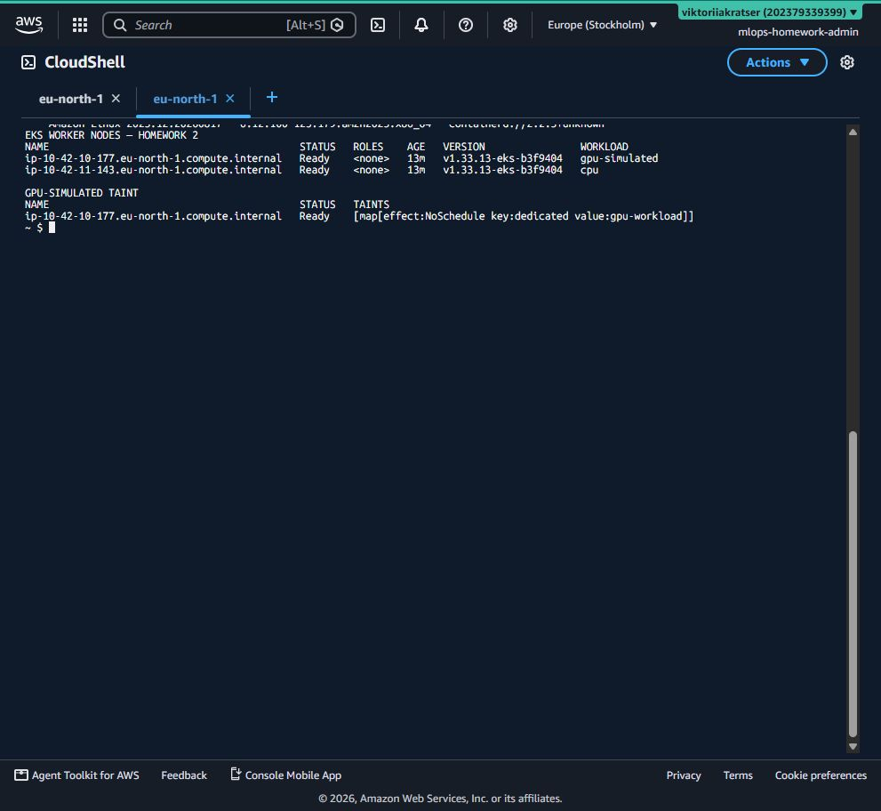
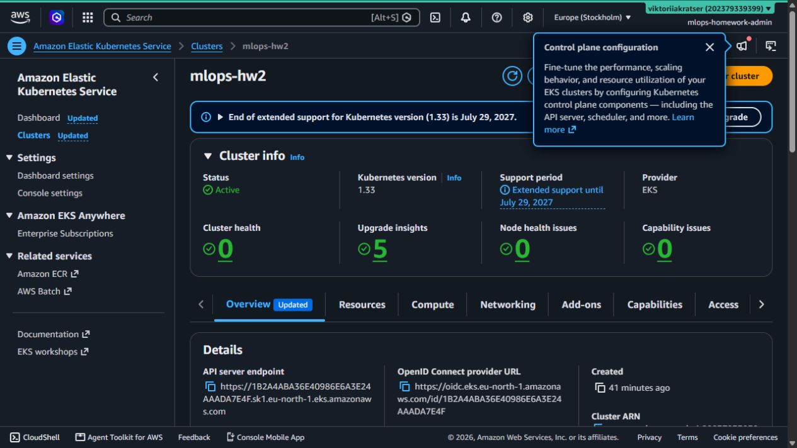
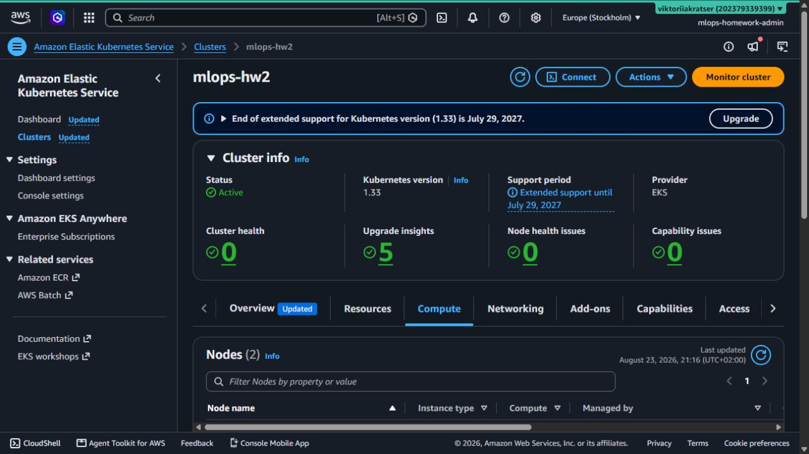
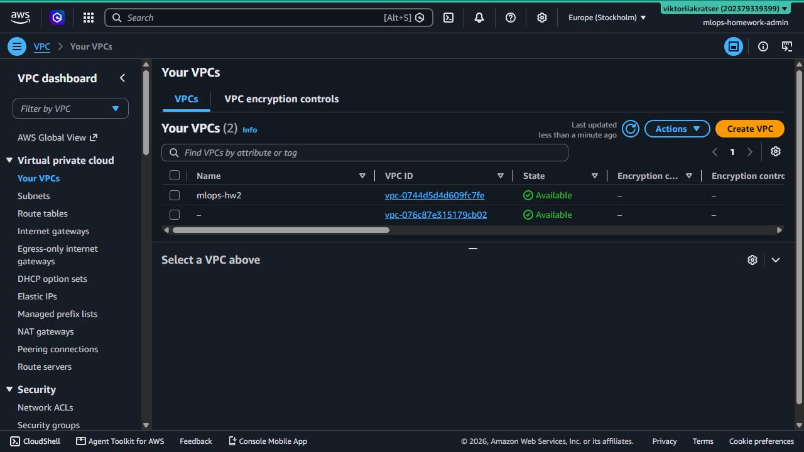
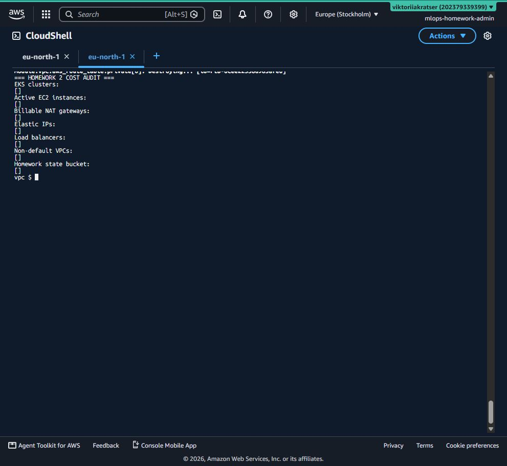
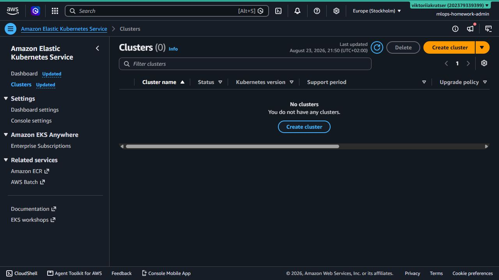
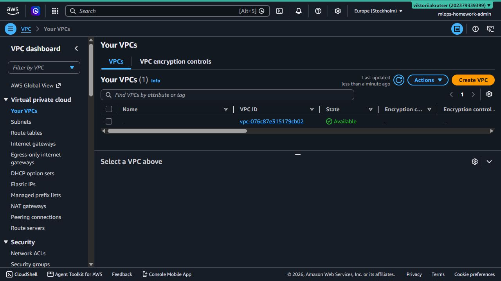

# Homework 2 — VPC and EKS with Terraform

The project contains two independent Terraform root modules. Apply `vpc/` first;
`eks/` reads its outputs from the S3 state through `terraform_remote_state`.

## Cost warning

This lab creates billable AWS resources: an EKS control plane, two EC2 worker nodes,
a NAT Gateway, Elastic IP and data transfer. Keep the environment alive only long
enough to capture the required evidence. The `gpu-nodes` group uses `t3.small` and
simulates workload isolation with a label and taint; it does **not** create a costly GPU.

## Structure

```text
eks-vpc-cluster/
├── vpc/
│   ├── main.tf
│   ├── variables.tf
│   ├── outputs.tf
│   ├── terraform.tf
│   ├── backend.tf
│   └── backend.hcl.example
├── eks/
│   ├── main.tf
│   ├── variables.tf
│   ├── outputs.tf
│   ├── terraform.tf
│   ├── backend.tf
│   ├── backend.hcl.example
│   └── data.tf
└── scripts/
    ├── destroy-all.ps1
    └── check-cost-resources.ps1
```

## 1. Prerequisites

- Terraform >= 1.10
- AWS CLI v2 authenticated to your own account
- `kubectl`
- an existing private S3 bucket with versioning enabled for Terraform state
- AWS permissions for VPC, EKS, EC2, IAM and S3 state access

Check the active identity before every apply:

```powershell
aws sts get-caller-identity
```

Never commit `backend.hcl`, credentials, `.terraform/` or `*.tfstate`.

## 2. Configure the S3 backend

Create a bucket once in the selected region. Enable versioning, block all public
access and use the same bucket for both states with different keys.

Copy both templates and replace the placeholder bucket name:

```powershell
Copy-Item vpc/backend.hcl.example vpc/backend.hcl
Copy-Item eks/backend.hcl.example eks/backend.hcl
```

The keys must remain different:

```text
homework-2/vpc/terraform.tfstate
homework-2/eks/terraform.tfstate
```

## 3. Validate and apply VPC first

```powershell
Set-Location vpc
terraform fmt -check
terraform init -backend-config=backend.hcl
terraform validate
terraform plan -out=vpc.tfplan
terraform apply vpc.tfplan
terraform output
```

The module creates two public and two private subnets in different availability
zones and one NAT Gateway. A single NAT is intentionally used to reduce lab cost.

## 4. Apply EKS second

Pass the same state bucket used by the VPC backend:

```powershell
Set-Location ../eks
terraform init -backend-config=backend.hcl
terraform validate
terraform plan -var="state_bucket=YOUR_BUCKET" -out=eks.tfplan
terraform apply eks.tfplan
```

The EKS root module obtains `vpc_id` and `private_subnets` exclusively through:

```hcl
data "terraform_remote_state" "vpc" { ... }
```

## 5. Connect with kubectl

```powershell
aws eks --region eu-north-1 update-kubeconfig --name mlops-hw2
kubectl get nodes -o wide
kubectl get nodes --show-labels
```

Expected result: two `Ready` nodes. One has `workload=cpu`; the other has
`workload=gpu-simulated` and the `dedicated=gpu-workload:NoSchedule` taint.

## 6. Required destruction order

Delete EKS first because its node groups depend on the VPC. Delete VPC only after
the EKS destroy succeeds:

```powershell
powershell -ExecutionPolicy Bypass -File scripts/destroy-all.ps1 -StateBucket YOUR_BUCKET
```

Then verify that no homework resources remain:

```powershell
powershell -ExecutionPolicy Bypass -File scripts/check-cost-resources.ps1
```

Do not delete the S3 state bucket until both Terraform destroys are complete and
you have saved the evidence required for submission. Afterward, delete the state
objects and bucket if it exists only for this homework.

## 7. Результати фактичного запуску в AWS

Середовище було розгорнуте в `eu-north-1` (Stockholm). EKS-кластер отримав
статус `Active`, обидві managed node groups — `Active`, а `kubectl` показав два
worker nodes у статусі `Ready`.

### Два Kubernetes-вузли `Ready`, labels і taint



### EKS cluster `mlops-hw2` — `Active`



### Дві managed node groups — `Active`



### VPC `mlops-hw2` — `Available`, CIDR `10.42.0.0/16`



Докладний опис перевірки й очищення ресурсів наведено у [report.md](report.md).

### Підтвердження очищення після завершення роботи

CLI-аудит повернув порожні списки для EKS, активних EC2, billable NAT Gateway,
Elastic IP, load balancers, non-default VPC і homework state bucket.



AWS Console: `Clusters (0)` та лише стандартний default VPC.




