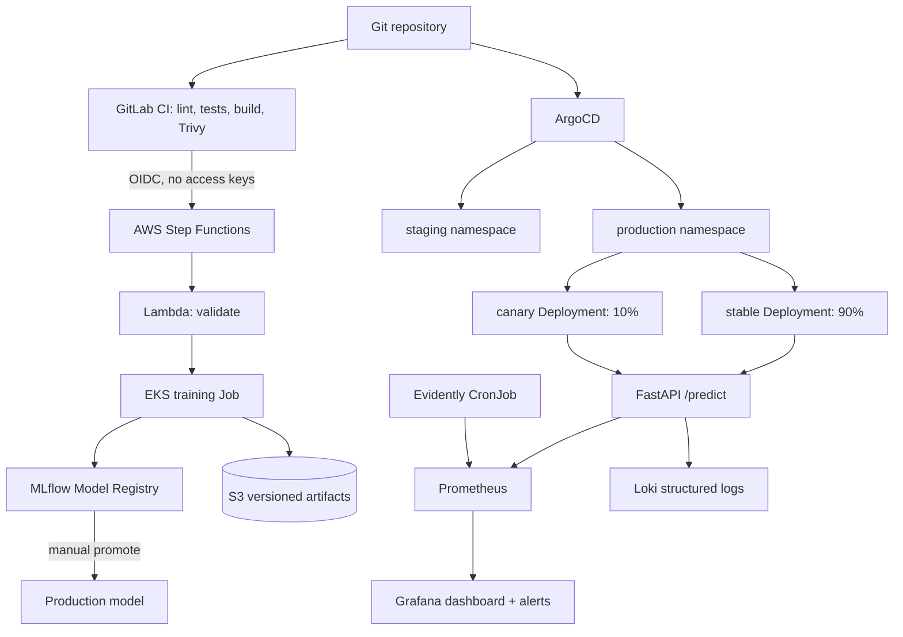

# Фінальний проєкт: production-ready MLOps-платформа

Авторка: **Viktoriia_Kratser**  
Модель: multiclass `LogisticRegression` на Iris  
Deployment strategy: **Canary 90/10**  
Cloud: AWS (`eu-north-1`)

## 1. Що саме ми будуємо

Це не просто модель, а керований життєвий цикл моделі від Git commit до
production. GitLab CI перевіряє код, збирає immutable images і через AWS OIDC
запускає Step Functions. State machine валідує запит та створює training Job в
EKS. Job тренує модель, записує параметри, метрики, Git SHA і dataset SHA256 у
MLflow, а artifact - у versioned S3. Нова Model Version отримує статус
`Staging`; лише окрема ручна job може перевести її в `Production`.



Простими словами:

1. **Terraform** створює AWS та bootstrap-компоненти.
2. **Kubernetes/EKS** запускає контейнери й відновлює їх після збоїв.
3. **Helm** параметризує Kubernetes-маніфести.
4. **ArgoCD** постійно звіряє кластер із Git і виправляє drift; через нього ж
   встановлюється `ingress-nginx` для Canary-маршрутизації.
5. **MLflow** відповідає на питання «яка версія моделі, як навчена і де artifact».
6. **Canary** обмежує blast radius нової версії десятьма відсотками трафіку.
7. **Prometheus/Grafana/Loki/Evidently** показують швидкість, помилки, ресурси,
   логи та data drift.

## 2. Структура репозиторію

```text
final-project/
├── inference-service/       # FastAPI, Pydantic, rate limiting, /metrics
├── training/                # train/register, promote, rollback, Evidently
├── mlflow-server/           # власний MLflow Docker image
├── step-functions/lambda/   # дешеві validate/finalize Lambda
├── helm/
│   ├── inference/           # stable + canary, probes, security, ServiceMonitor
│   ├── mlflow/              # MLflow + PostgreSQL
│   └── observability-addons/# Grafana dashboard, alerts, drift CronJob
├── terraform/modules/       # vpc, eks, argocd, mlflow, monitoring, training
├── gitops/                  # читабельна копія ApplicationSet
├── scripts/                 # bootstrap, перевірка, знищення
├── assets/                  # фактичні demo screenshots
├── README.md
├── RUNBOOK.md
├── ADR.md
├── THREAT_MODEL.md
└── REPORT.md
```

## 3. Передумови

- Terraform `>= 1.5`;
- AWS CLI v2;
- `kubectl`, сумісний з EKS 1.34;
- Helm 3;
- Docker;
- GitLab CI з OIDC;
- Python 3.12 для локальних тестів.

AWS identity перевіряється без друку секретів:

```bash
aws sts get-caller-identity
aws configure get region
```

## 4. Локальна перевірка - $0

```bash
python -m venv .venv
source .venv/bin/activate  # Windows: .venv\Scripts\Activate.ps1
pip install -r inference-service/requirements-dev.txt
pip install -r training/requirements.txt pytest ruff

PYTHONPATH=inference-service pytest -q inference-service/tests
PYTHONPATH=training pytest -q training/tests
ruff check inference-service/app inference-service/tests training/src training/tests

terraform -chdir=terraform fmt -check -recursive
terraform -chdir=terraform init -backend=false
terraform -chdir=terraform validate
helm lint helm/inference
helm lint helm/mlflow
helm lint helm/observability-addons
```

Локальний API використовує детерміновану fallback-модель тільки в
`MLOPS_ENVIRONMENT=local`:

```bash
cd inference-service
uvicorn app.main:app --reload
curl -X POST http://127.0.0.1:8000/predict \
  -H 'content-type: application/json' \
  -d '{"sepal_length":5.1,"sepal_width":3.5,"petal_length":1.4,"petal_width":0.2}'
```

## 5. AWS bootstrap - покрокво

> **Вартість.** EKS control plane, EC2 worker nodes і NAT Gateway платні.
> Піднімайте стенд лише для перевірки; після screenshots обов'язково виконайте
> розділ 11. Budget не вимикає ресурси автоматично. Ingress controller має
> `ClusterIP`, тому окремий AWS Load Balancer для demo не створюється.

### 5.1 Remote state bucket

Bucket для Terraform state створюється один раз вручну, бо Terraform не може
зберегти state у bucket, якого ще немає:

```bash
export AWS_REGION=eu-north-1
export STATE_BUCKET="viktoriia-mlops-final-tfstate-$(aws sts get-caller-identity --query Account --output text)"
aws s3api create-bucket --bucket "$STATE_BUCKET" \
  --region "$AWS_REGION" \
  --create-bucket-configuration LocationConstraint="$AWS_REGION"
aws s3api put-bucket-versioning --bucket "$STATE_BUCKET" \
  --versioning-configuration Status=Enabled
cp terraform/backend.hcl.example terraform/backend.hcl
# Замініть REPLACE_WITH_UNIQUE_TERRAFORM_STATE_BUCKET на $STATE_BUCKET.
```

### 5.2 Вхідні параметри

```bash
cp terraform/terraform.tfvars.example terraform/terraform.tfvars
MY_IP=$(curl -fsS https://checkip.amazonaws.com | tr -d '\n')
sed -i "s#203.0.113.10/32#${MY_IP}/32#" terraform/terraform.tfvars
# Також замініть release_image_tag на повний SHA з `git rev-parse HEAD`.
```

### 5.3 Дві відтворювані фази

```bash
terraform -chdir=terraform init -backend-config=backend.hcl
terraform -chdir=terraform plan -out=phase1.tfplan \
  -target=module.vpc -target=module.eks
terraform -chdir=terraform apply phase1.tfplan

aws eks update-kubeconfig --region eu-north-1 \
  --name "$(terraform -chdir=terraform output -raw cluster_name)"
kubectl get nodes

terraform -chdir=terraform plan -out=platform.tfplan
terraform -chdir=terraform apply platform.tfplan
```

`-target` застосовується лише для bootstrap-фази, а після неї обов'язково йде
повний plan/apply, тому state сходиться до повної конфігурації.

## 6. GitLab CI variables

У `Settings -> CI/CD -> Variables` потрібні лише не-секретні ідентифікатори:

- `AWS_ROLE_ARN` = output `gitlab_ci_role_arn`;
- `AWS_ACCOUNT_ID`;
- `STATE_MACHINE_ARN`;
- `EKS_CLUSTER_NAME`;
- `ARTIFACT_BUCKET`;
- `INFERENCE_REPOSITORY`, `TRAINING_REPOSITORY`, `MLFLOW_REPOSITORY`.

AWS access key/secret key **не створюються**. Trust policy приймає тільки OIDC
token конкретного GitLab project path.

## 7. Model Registry workflow

Після green pipeline:

1. `train-model` запускає Step Functions;
2. `ValidateRequest` відсіює некоректний Git SHA;
3. `TrainEvaluateRegister` створює EKS Job;
4. quality gate вимагає `accuracy >= 0.90`;
5. MLflow створює нову Model Version у `Staging`;
6. S3 має versioned object і metadata `sha256`;
7. manual job `promote-production` переводить обрану версію в `Production`.

GitOps values після promotion мають містити точні `modelVersion` і
`modelSha256`. ArgoCD побачить commit і синхронізує canary.

## 8. Перевірка Canary 90/10

```bash
kubectl -n ingress-nginx port-forward svc/ingress-nginx-controller 8080:80
for i in $(seq 1 100); do
  curl -s -H 'Host: production.iris.local' \
    -H 'content-type: application/json' \
    -d '{"sepal_length":5.1,"sepal_width":3.5,"petal_length":1.4,"petal_width":0.2}' \
    http://127.0.0.1:8080/predict | jq -r .model_version
done | sort | uniq -c
```

Очікування - приблизно 90 відповідей stable та 10 canary. Це статистичний, а
не гарантовано точний розподіл кожних ста запитів.

## 9. Спостережність

```bash
kubectl -n monitoring port-forward svc/monitoring-grafana 3000:80
kubectl -n mlops-system port-forward svc/mlflow 5000:5000
kubectl -n argocd port-forward svc/argocd-server 8081:80
```

Grafana dashboard `Iris Inference - SLO and Model Quality` показує request rate,
p50/p95 latency, error rate, CPU, RAM і Evidently drift score. Prometheus alerts:

- p95 > 0.5 s протягом 5 хв;
- error rate > 1% протягом 3 хв;
- drift score > 0.3 протягом 15 хв.

Escalation: warning -> MLOps engineer; critical -> MLOps engineer + service
owner. Детальні дії наведені в [RUNBOOK.md](RUNBOOK.md).

## 10. Rollback однією командою / commit

Model Registry rollback:

```bash
MLFLOW_TRACKING_URI=http://127.0.0.1:5000 \
ARTIFACT_BUCKET="$(terraform -chdir=terraform output -raw artifact_bucket)" \
python -m training.src.promote rollback --version PREVIOUS_GOOD_VERSION
```

Kubernetes rollback - повернути Git commit, який містив справні image tag,
model version і checksum:

```bash
git revert BAD_DEPLOYMENT_COMMIT
git push
```

ArgoCD автоматично відтворить попередній desired state. Не використовуйте
ручний `kubectl rollout undo`: Git негайно поверне declarative state назад.

## 11. Повне видалення після demo

```bash
bash scripts/destroy.sh
bash scripts/aws-cost-audit.sh
```

Не видаляйте remote state bucket, доки `terraform destroy` не закінчився.
Після zero-resource audit видаліть усі версії state bucket і сам bucket.

## 12. Матеріали здачі

- [REPORT.md](REPORT.md) - фактичний demo-trace та screenshots;
- [RUNBOOK.md](RUNBOOK.md) - production-інциденти й операції;
- [ADR.md](ADR.md) - обґрунтування Canary;
- [THREAT_MODEL.md](THREAT_MODEL.md) - attack surface та mitigations.

У репозиторії немає AWS keys, паролів або приватних kubeconfig. Перевірка перед
push: `git grep -nEi '(AKIA|aws_secret_access_key|BEGIN.*PRIVATE KEY)'`.
