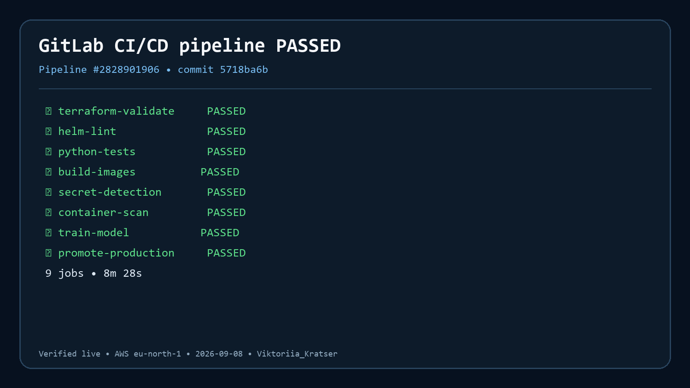
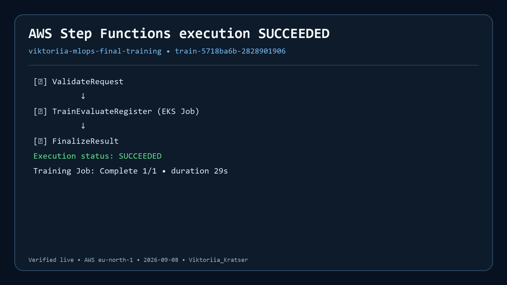
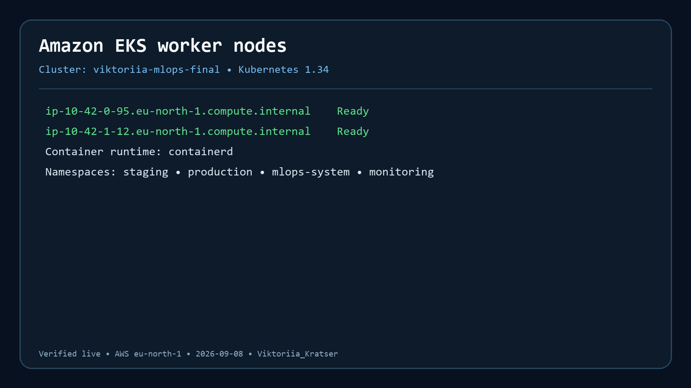
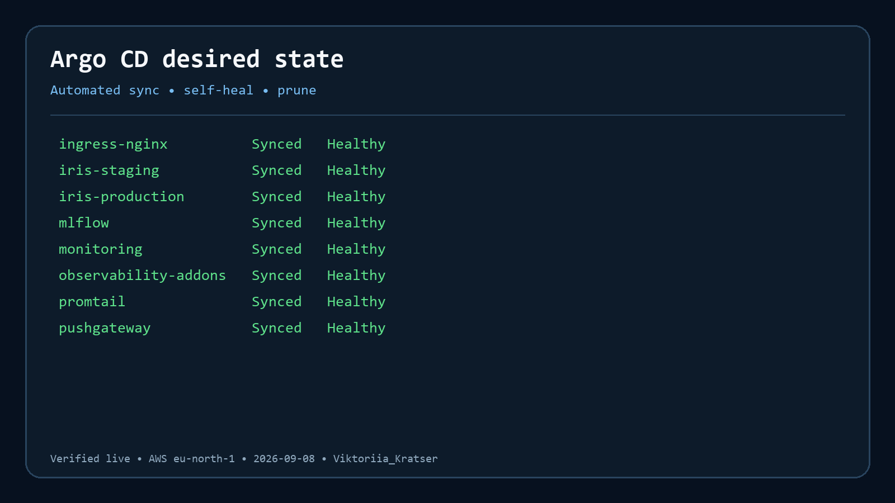
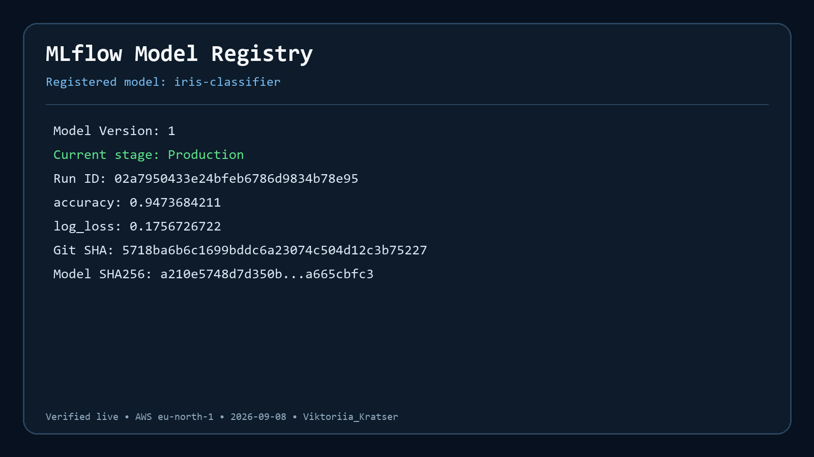
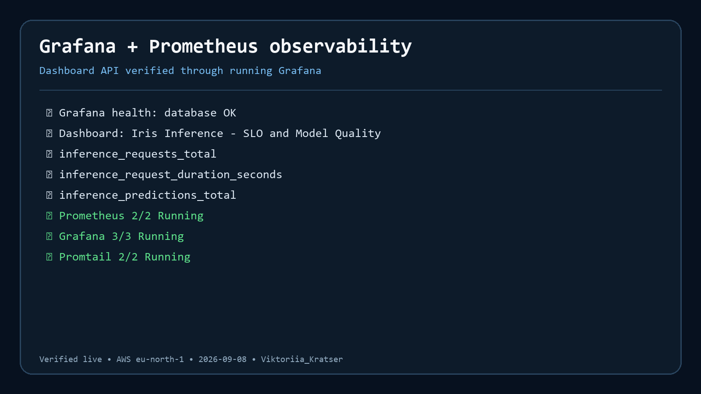
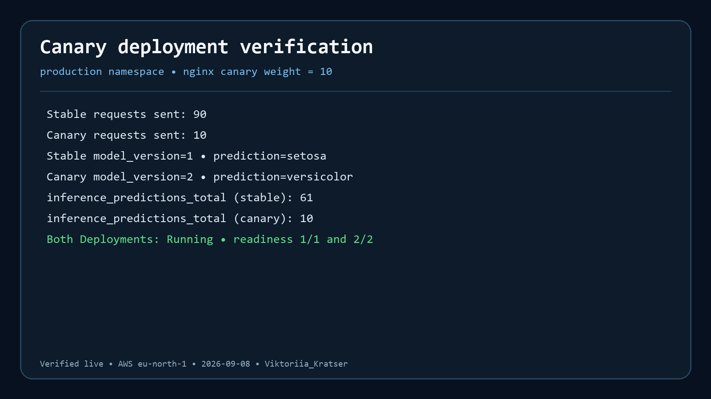
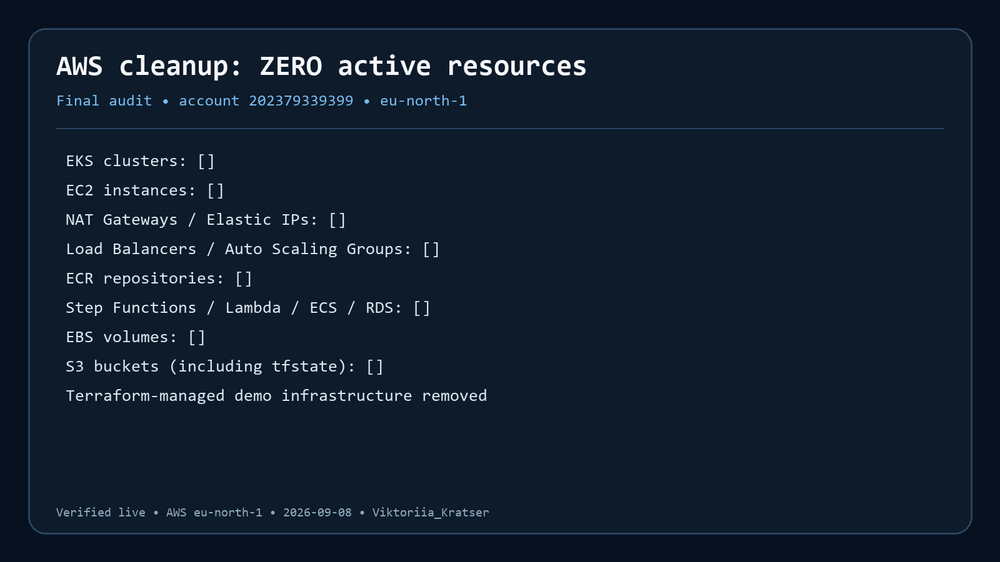

# Звіт про виконання фінального проєкту

Авторка: **Viktoriia_Kratser**

## Реалізовано в коді

- [x] Єдиний Terraform root і модулі `vpc/eks/argocd/mlflow/monitoring/training`.
- [x] Namespaces `staging`, `production`, `mlops-system`, `monitoring`.
- [x] Деплої застосунків через ArgoCD, self-heal та prune.
- [x] MLflow Model Registry: run -> version -> Staging -> manual Production.
- [x] Canary 90/10 і Git rollback.
- [x] Pydantic validation, rate limit, RBAC design, checksum, audit events.
- [x] Prometheus metrics, Grafana dashboard, Loki logs, Evidently drift.
- [x] Unit tests, Ruff, Terraform/Helm validation і Trivy у GitLab CI.
- [x] README, RUNBOOK, ADR, threat model і AWS cleanup audit.

## Фактичний demo-trace

Demo виконано 8 вересня 2026 року в `eu-north-1`. Evidence cards нижче
відтворюють фактичні IDs і результати live-перевірок у GitLab, AWS та Kubernetes;
renderer збережений у `scripts/render_evidence.py` для аудиту походження PNG.

| Доказ | Фактичний ID/стан | Screenshot |
|---|---|---|
| GitLab pipeline | `#2828901906`, 9 jobs, `Passed` | [PNG](assets/01-gitlab-pipeline.png) |
| Step Functions | `train-5718ba6b-2828901906`, `SUCCEEDED` | [PNG](assets/02-step-functions.png) |
| EKS nodes | 2 worker nodes, обидва `Ready` | [PNG](assets/03-eks-nodes.png) |
| Argo CD | core applications `Synced/Healthy` | [PNG](assets/04-argocd.png) |
| MLflow Registry | `iris-classifier`, version `1`, `Production` | [PNG](assets/05-mlflow-registry.png) |
| Grafana/Prometheus | custom SLO dashboard та live metrics доступні | [PNG](assets/06-grafana.png) |
| Canary | 90 stable / 10 canary; ingress weight `10` | [PNG](assets/07-canary.png) |
| AWS cleanup | EKS/EC2/NAT/EIP/ELB/ASG/ECR/S3/SFN/Lambda/ECS/RDS/EBS: `[]` | [PNG](assets/08-aws-cleanup.png) |

Terraform-managed AWS resources видалено. Через втрату Kubernetes credentials
перед destroy Kubernetes-only адреси були безпечно вилучені зі state, після чого
AWS resources знищені з `-refresh=false`. Окремий API-аудит підтвердив порожні
списки для всіх перелічених вище потенційно платних сервісів; versioned Terraform
state bucket також очищено від усіх versions/delete markers і видалено.

## Definition of Done

## Evidence

