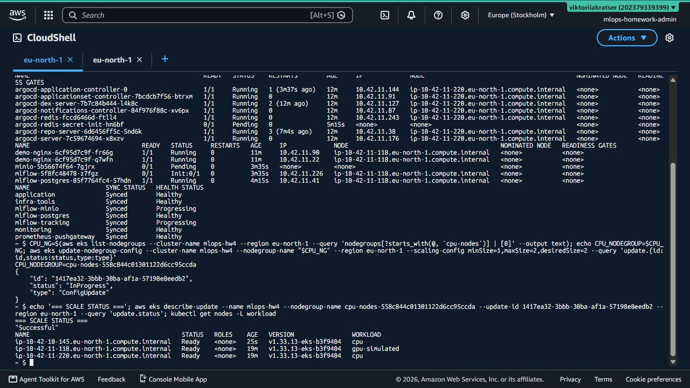
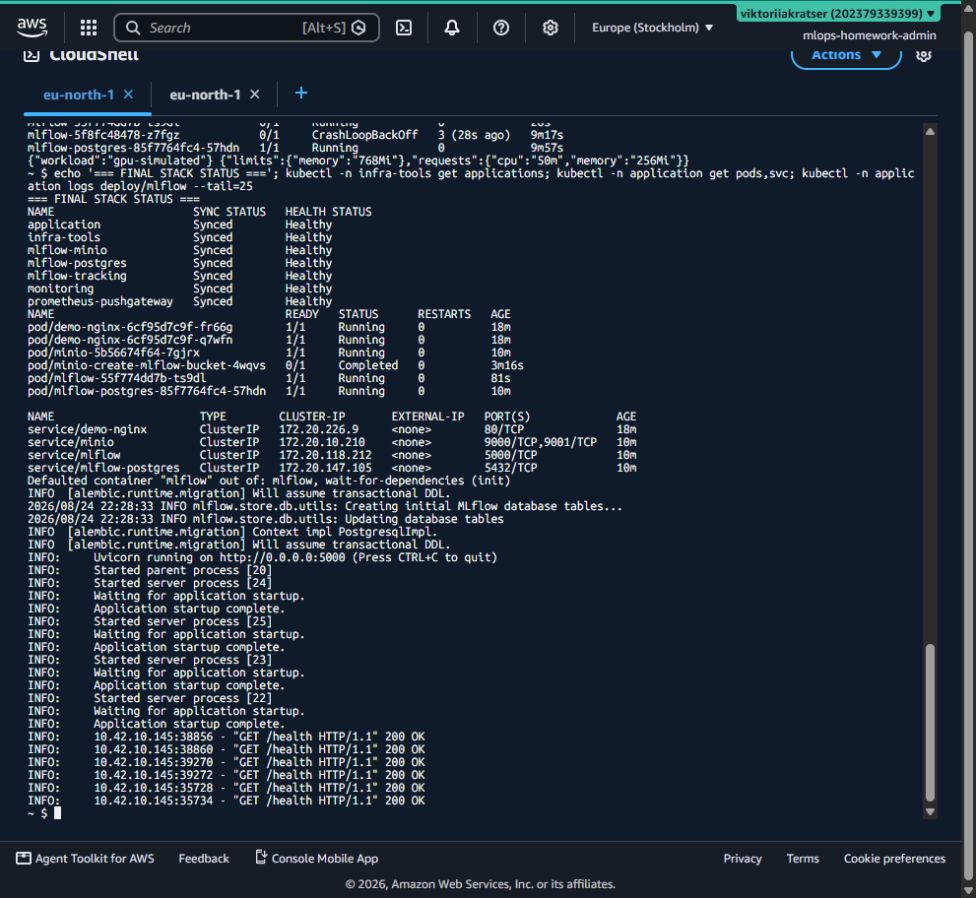
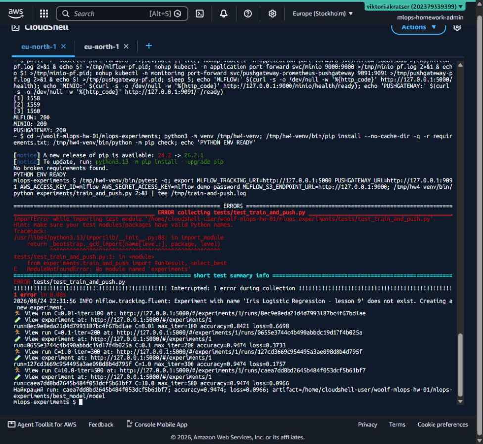
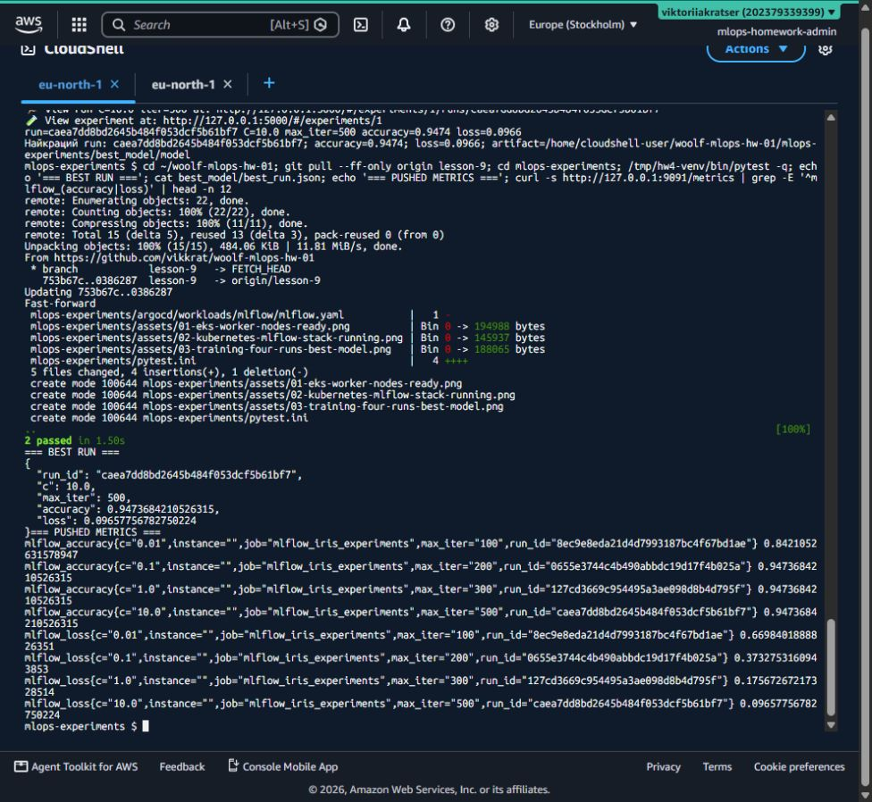
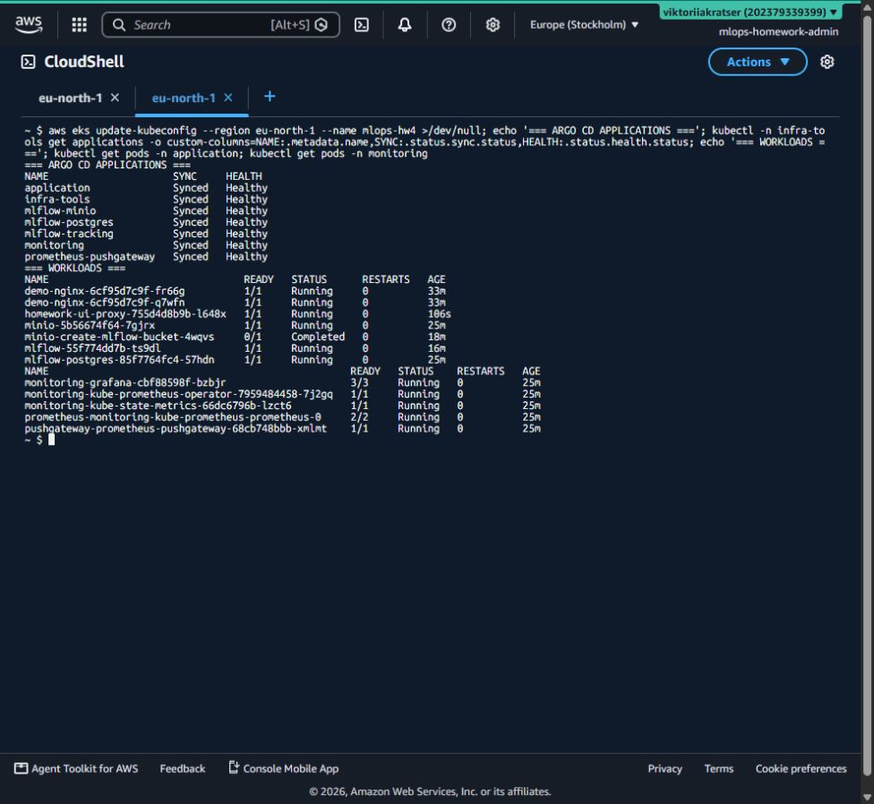
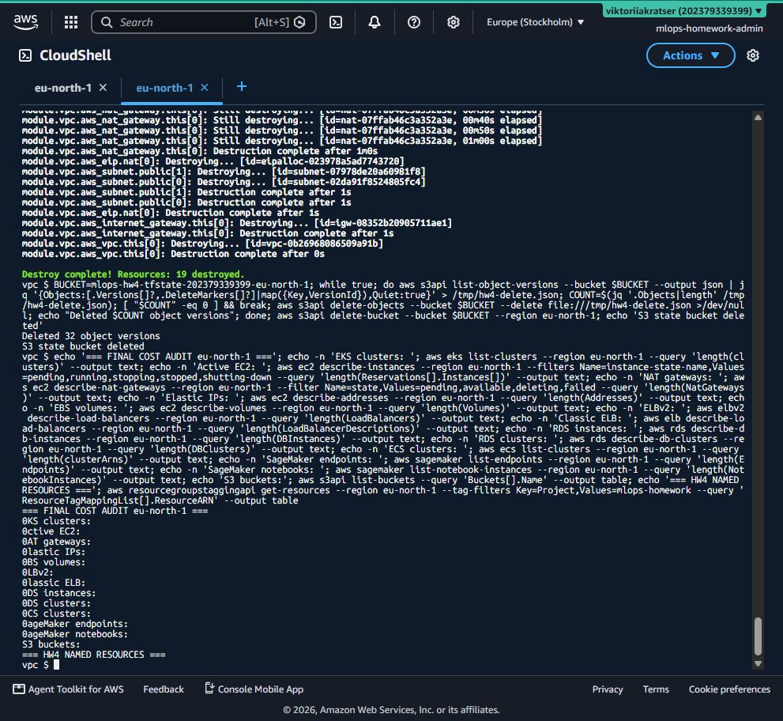

# ДЗ №4: MLflow experiments і метрики у Grafana

Проєкт реалізує відстеження серії ML-експериментів: MLflow зберігає metadata у
PostgreSQL та artifacts у MinIO, а фінальні `accuracy` і `loss` передаються в
Prometheus PushGateway та переглядаються у Grafana. Усі кластерні сервіси
описані декларативно як Argo CD Applications.

## Архітектура

```text
train_and_push.py
  ├─ HTTP → MLflow Tracking Server :5000
  │          ├─ metadata → PostgreSQL :5432
  │          └─ artifacts → MinIO/S3 :9000
  └─ HTTP → PushGateway :9091
                       ↑ scrape
                    Prometheus → Grafana

Git lesson-9 → Argo CD → Kubernetes desired state
```

MLflow run - це одна зафіксована спроба навчання з конкретними параметрами,
метриками, тегами й artifacts. PostgreSQL зберігає структуровану історію runs;
MinIO зберігає більші бінарні об'єкти моделі. PushGateway потрібен тому, що
локальний training script є короткоживучим процесом і не має постійного `/metrics`
endpoint, який міг би scrape-ити Prometheus.

## Структура

```text
mlops-experiments/
├── argocd/
│   ├── applications/       # Argo CD Application CR для 5 компонентів
│   └── workloads/          # декларативні MinIO/PostgreSQL/MLflow ресурси
├── experiments/
│   └── train_and_push.py
├── best_model/             # з'являється після успішного запуску
├── tests/
├── assets/
├── .env.example
└── requirements.txt
```

## Розгортання через Argo CD

Перед початком EKS cluster та Argo CD мають бути доступні, а kubeconfig -
налаштований. Application-об'єкти створюються в `infra-tools`, workload-и - в
`application` і `monitoring`:

```bash
kubectl apply -f mlops-experiments/argocd/applications/

kubectl -n infra-tools get applications
kubectl -n application get pods,svc
kubectl -n monitoring get pods,svc,servicemonitors
```

Argo CD автоматично застосовує зміни з гілки `lesson-9`, виконує `selfHeal` та
`prune`. Сервіси мають тип `ClusterIP`, тому AWS Load Balancer не створюється.

## Локальний доступ через port-forward

Кожну команду запускайте в окремому CloudShell/terminal tab:

```bash
kubectl -n application port-forward svc/mlflow 5000:5000
kubectl -n application port-forward svc/minio 9000:9000
kubectl -n monitoring port-forward svc/pushgateway-prometheus-pushgateway 9091:9091
kubectl -n monitoring port-forward svc/monitoring-grafana 3000:80
```

Адреси після port-forward:

- MLflow: <http://127.0.0.1:5000>;
- MinIO API: <http://127.0.0.1:9000>;
- PushGateway: <http://127.0.0.1:9091>;
- Grafana: <http://127.0.0.1:3000> (`admin` / навчальний пароль із
  `monitoring.yaml`).

## Запуск експериментів

```bash
cd mlops-experiments
python -m venv .venv
source .venv/bin/activate        # Windows PowerShell: .venv\Scripts\Activate.ps1
pip install -r requirements.txt
cp .env.example .env             # Windows: Copy-Item .env.example .env
python experiments/train_and_push.py
```

Скрипт:

1. один раз робить deterministic stratified split Iris;
2. тренує чотири `LogisticRegression` з різними `C`/`max_iter`;
3. створює окремий MLflow run для кожної моделі;
4. логує parameters, `accuracy`, `loss`, tags та sklearn model artifact;
5. пушить `mlflow_accuracy` і `mlflow_loss` із label `run_id` у PushGateway;
6. вибирає найбільшу accuracy (при нічиїй - найменший loss);
7. завантажує artifact переможця з MinIO у `best_model/`.

## Перевірка MLflow

У MLflow UI відкрийте experiment `Iris Logistic Regression - lesson 9`.
Очікуються чотири runs. Для кожного доступні parameters `C`, `max_iter`,
`solver`, metrics `accuracy`/`loss`, tags і artifact `model`.

Фактичний запуск 25.08.2026 створив чотири незалежні runs:

| Run ID | C | max_iter | accuracy | loss |
|---|---:|---:|---:|---:|
| `8ec9e8eda21d4d7993187bc4f67bd1ae` | 0.01 | 100 | 0.842105 | 0.669840 |
| `0655e3744c4b490abbdc19d17f4b025a` | 0.1 | 200 | 0.947368 | 0.373275 |
| `127cd3669c954495a3ae098d8b4d795f` | 1.0 | 300 | 0.947368 | 0.175673 |
| `caea7dd8bd2645b484f053dcf5b61bf7` | 10.0 | 500 | 0.947368 | **0.096578** |

Переможець — `caea7dd...`: серед трьох моделей з однаковою найкращою
accuracy вона має найменший log loss. Її artifact успішно завантажено з MinIO
у `best_model/model` під час перевірки (бінарний файл навмисно не комітиться).

## Перевірка метрик у Grafana

Відкрийте **Grafana → Explore**, виберіть Prometheus datasource і виконайте:

```promql
mlflow_accuracy
```

```promql
mlflow_loss
```

Для табличного порівняння найкращої accuracy:

```promql
sort_desc(mlflow_accuracy)
```

PushGateway не є довготривалим сховищем: Prometheus scrape-ить його й формує
time series. Grouping key `run_id` зберігає окрему series для кожного run.

## Тести

```bash
python -m compileall experiments tests
pytest -q
```

## Безпека та контроль вартості

Це одноразове навчальне середовище: MinIO/PostgreSQL/Grafana використовують
`emptyDir`, а всі Services - `ClusterIP`. Demo credentials у маніфестах не можна
використовувати в production. Правильний production-підхід: External Secrets,
AWS Secrets Manager, persistent encrypted volumes, backup/restore та network
policies.

Порядок видалення після фіксації доказів:

1. видалити Applications/Argo CD;
2. видалити EKS і node groups;
3. видалити VPC, NAT Gateway та Elastic IP;
4. видалити всі версії Terraform state і S3 bucket;
5. виконати глобальний AWS cost-audit.

## Докази виконання













Розгорнуті UI не залишаються публічними після перевірки: це свідоме рішення
безпеки й контролю вартості. Термінальні докази показують ті самі фактичні дані
без постійного AWS Load Balancer.

Після завершення видалено: тимчасовий Load Balancer, Argo CD, EKS та обидві
node groups, усі EC2 workers, NAT Gateway, Elastic IP, VPC і 32 версії об'єктів
у Terraform state bucket. Контрольна перевірка `eu-north-1` показала `0` для
EKS, активних EC2, NAT, EIP, EBS, ELB/ELBv2, RDS, ECS і SageMaker; список S3
buckets також порожній.
