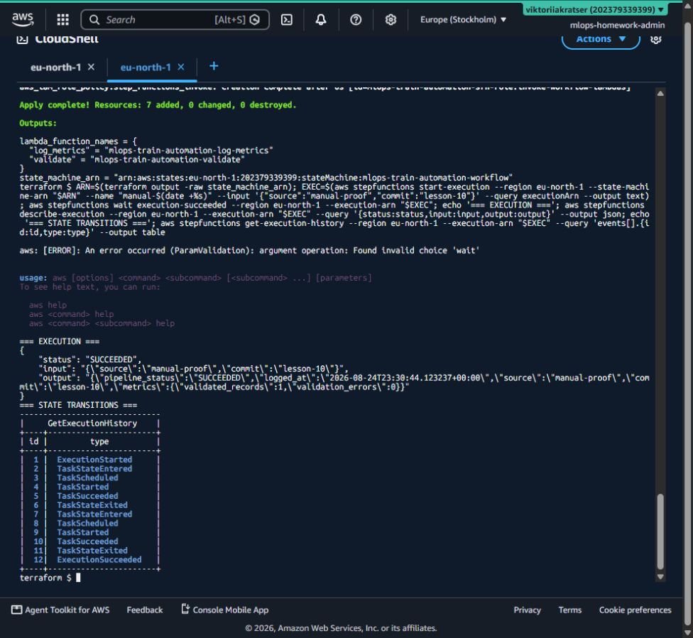
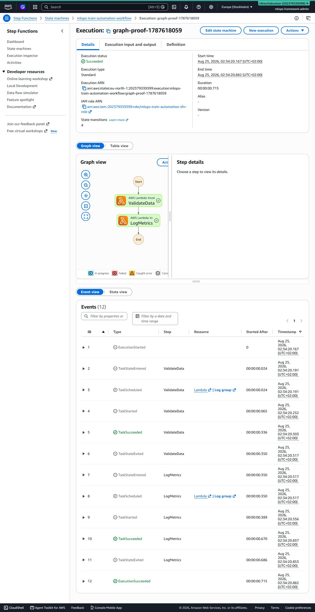
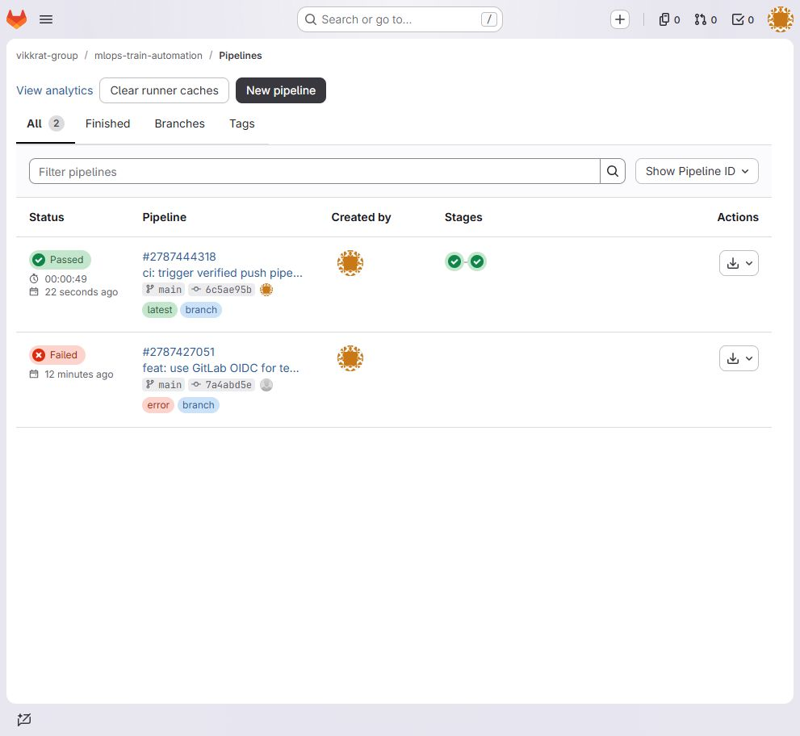
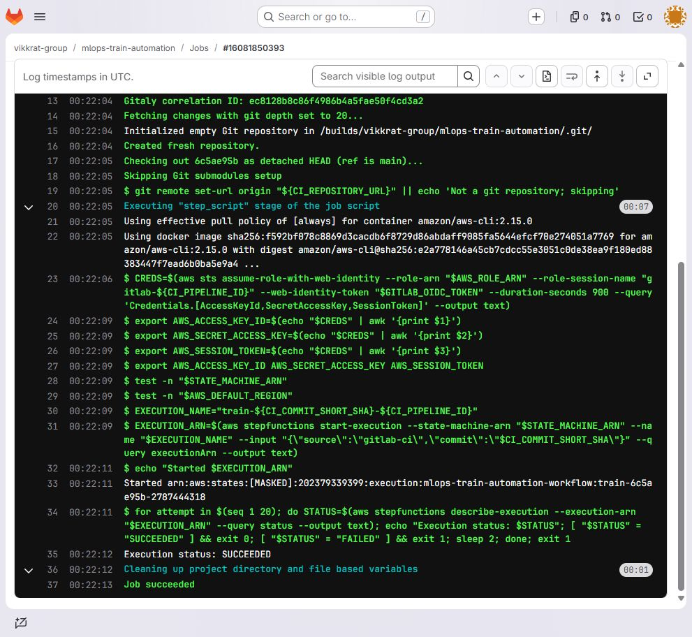
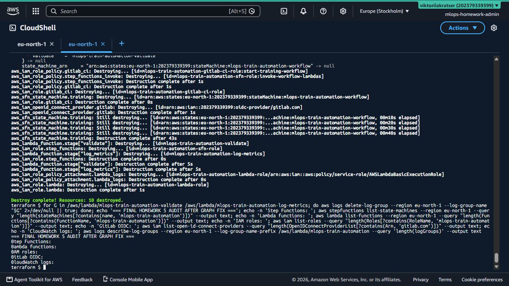

# Звіт про виконання ДЗ №5

Гілка: `lesson-10`  
Автор: `Viktoriia_Kratser`  
AWS region: `eu-north-1`

## Реалізовано

- дві Python Lambda з чітким JSON-контрактом;
- Step Functions Standard workflow `ValidateData → LogMetrics`;
- least-privilege IAM roles;
- повний Terraform deployment;
- GitLab CI jobs для Terraform validation і запуску workflow після push;
- unit tests для позитивного та помилкового сценаріїв.

## Фактичні докази

Terraform успішно створив `7` ресурсів: дві IAM roles, Lambda logging policy
attachment, inline Step Functions policy, дві Lambda та одну Standard Step
Function.

Ручна execution `manual-1787614242` отримала вхід:

```json
{"source":"manual-proof","commit":"lesson-10"}
```

та завершилася зі статусом `SUCCEEDED` за `0.716 s`. Execution history містить
два повні цикли `TaskStateEntered → TaskScheduled → TaskStarted → TaskSucceeded
→ TaskStateExited`, після чого — `ExecutionSucceeded`.

Фінальний результат:

```json
{
  "pipeline_status": "SUCCEEDED",
  "source": "manual-proof",
  "commit": "lesson-10",
  "metrics": {"validated_records": 1, "validation_errors": 0}
}
```





## GitLab CI

Приватний GitLab-проєкт:
`https://gitlab.com/vikkrat-group/mlops-train-automation`.

Push commit `6c5ae95b` автоматично створив pipeline `#2787444318`:

- `validate-terraform` — `Passed`;
- `train-model` — `Passed`;
- загальна тривалість — `49 s`;
- через GitLab OIDC отримано короткоживучі AWS STS credentials;
- запущено execution `train-6c5ae95b-2787444318`;
- фінальний статус AWS — `SUCCEEDED`.





Одноразовий GitLab PAT із scope `write_repository`, використаний лише для
первинного push, одразу відкликано; локальну копію токена видалено. AWS access
keys не створювалися й не зберігалися в GitLab variables.

## AWS teardown і контроль вартості

Після збирання доказів виконано `terraform destroy`:

- `Destroy complete! Resources: 10 destroyed`;
- видалено Step Function і дві Lambda;
- видалено Lambda/Step Functions/GitLab CI IAM roles та inline policies;
- видалено GitLab OIDC provider;
- окремо видалено автоматично створені Lambda CloudWatch log groups.

Фінальний аудит показав:

| Категорія | Залишок |
|---|---:|
| Step Functions цього ДЗ | 0 |
| Lambda цього ДЗ | 0 |
| IAM roles цього ДЗ | 0 |
| GitLab OIDC providers | 0 |
| CloudWatch log groups цього ДЗ | 0 |
| Активні EC2 | 0 |
| EKS clusters | 0 |
| NAT gateways | 0 |
| Load Balancers | 0 |



Отже, після завершення перевірки ресурсів, які продовжують споживати кошти,
не залишилося. Billing може із затримкою показувати вже виконані Lambda та Step
Functions transitions, але нові нарахування після teardown не продовжуються.
