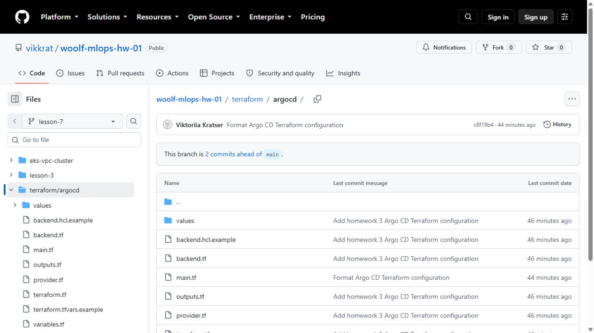
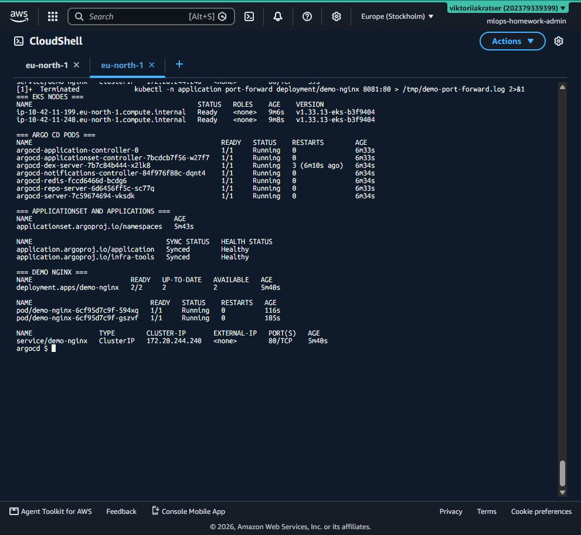
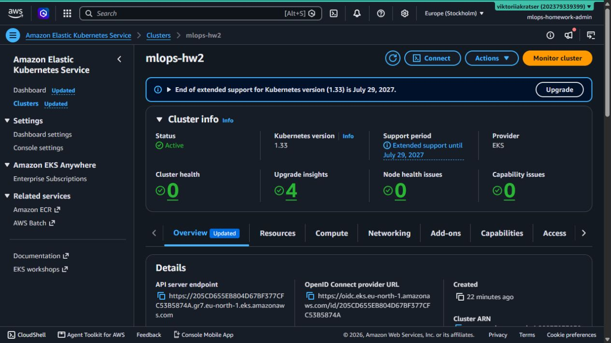
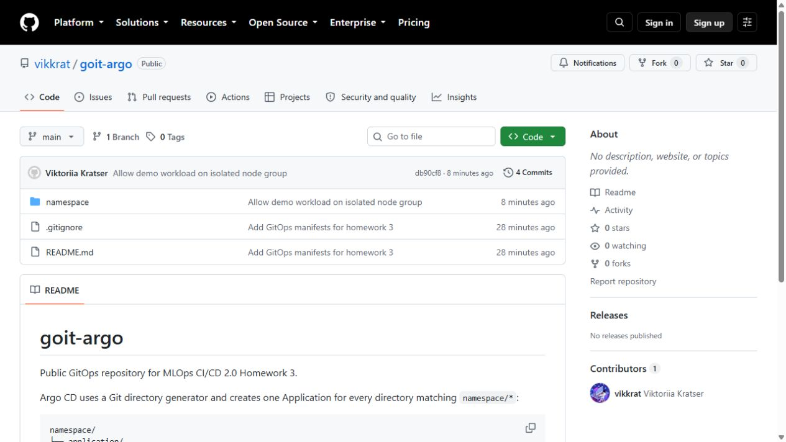
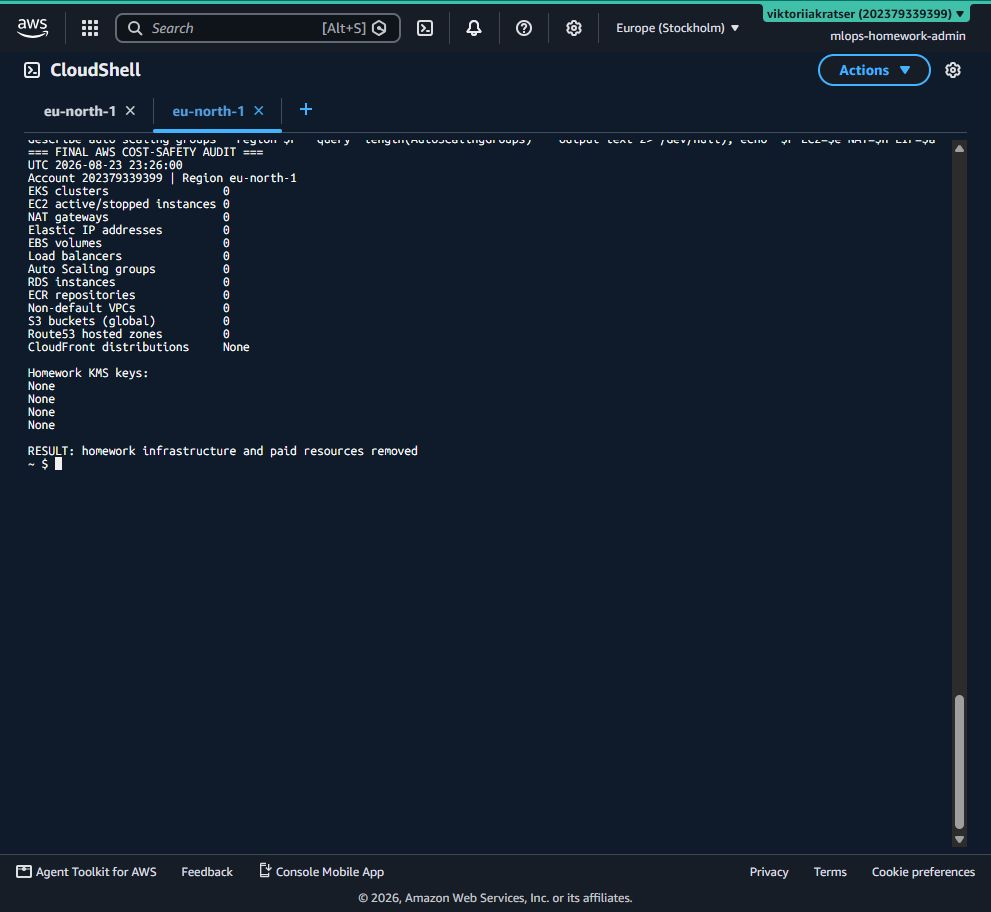

# Звіт: розгортання Argo CD через Terraform

Дата фактичної перевірки: 24 серпня 2026 року.  
AWS region: `eu-north-1` (Stockholm).  
EKS cluster: `mlops-hw2`.  
GitOps repository: <https://github.com/vikkrat/goit-argo>.

## 1. Що реалізовано

Argo CD встановлено в уже створений EKS-кластер ресурсом Terraform
`helm_release.argocd`. Для Helm chart використано окремий файл
`values/argocd-values.yaml`: сервіс `ClusterIP`, параметр `server.insecure`,
обмежені ресурси компонентів, RBAC `role:readonly` за замовчуванням і збільшений
repo-server timeout.

Terraform також створює `ApplicationSet` з Git directory generator. Generator
відстежує `namespace/*` у публічному репозиторії `vikkrat/goit-argo` і створює
окрему Argo CD Application для кожного каталогу:

- `namespace/application` - Deployment і ClusterIP Service `demo-nginx`;
- `namespace/infra-tools` - декларація namespace Argo CD.

Автоматична синхронізація має `prune`, `selfHeal`, retry/backoff та
`CreateNamespace=true`.

## 2. Terraform-перевірка

У AWS CloudShell виконано:

```text
terraform init
terraform fmt -check
terraform validate
terraform apply
```

`terraform validate` завершився повідомленням `Success! The configuration is
valid.`. План Argo CD містив `2 to add`: Helm release та ApplicationSet. Apply
завершився як `Resources: 2 added, 0 changed, 0 destroyed`.

Гілка `lesson-7` містить окремий Terraform root `terraform/argocd`:



## 3. Перевірка EKS та Argo CD

Після `aws eks update-kubeconfig` команда `kubectl get nodes` показала дві worker
nodes у статусі `Ready`. У namespace `infra-tools` запущено сім компонентів
Argo CD; усі pod-и мають статус `Running`.

`ApplicationSet` з назвою `namespaces` створив дві Applications. Фінальний стан:

```text
application   Synced   Healthy
infra-tools   Synced   Healthy
```

Deployment `demo-nginx` має `2/2` ready replicas, обидва pod-и `Running`, а
Service має тип `ClusterIP`. На доказовому екрані одночасно видно EKS nodes,
Argo CD pods, ApplicationSet, Applications та Nginx:



AWS Console також підтверджує, що кластер `mlops-hw2` має статус `Active`, версію
Kubernetes `1.33` і нуль cluster/node health issues:



## 4. Реальний GitOps-сценарій і діагностика

Перший GitOps sync успішно створив Deployment, але Nginx pod-и були `Pending`.
Scheduler events показали дві конкретні причини:

```text
1 Too many pods
1 node(s) had untolerated taint {dedicated: gpu-workload}
```

CPU-нода досягла pod limit, а друга навчальна node group була ізольована taint-ом.
У GitOps-маніфест додано toleration для `dedicated=gpu-workload:NoSchedule` і
виконано commit `db90cf8`. Без ручного `kubectl apply` Argo CD сам прочитав новий
commit, оновив Deployment і перевів Application зі стану `Progressing` у
`Synced/Healthy`. Це демонструє саме GitOps flow: Git є джерелом істини.

Публічний GitOps-репозиторій і останній commit:



## 5. Перевірка HTTP-доступу

Доступ до демо-застосунку перевірено без створення AWS Load Balancer:

```bash
kubectl -n application port-forward deployment/demo-nginx 8081:80
curl http://localhost:8081
```

Фактичний результат: `HTTP_STATUS=200`. Використання `ClusterIP` і локального
port-forward не створює додатковий платний Load Balancer.

## 6. Контроль витрат і видалення

Для лабораторії використано один NAT Gateway, один EKS control plane і дві
`t3.small` nodes. Справжні GPU instances не створювалися. Після фіксації доказів
ресурси видалено в безпечному порядку:

1. Terraform Argo CD;
2. Terraform EKS;
3. Terraform VPC/NAT/EIP;
4. усі версії об'єктів і S3 state bucket;
5. фінальний AWS audit порожніх списків.

Terraform підтвердив `Resources: 2 destroyed` для Argo CD та
`Resources: 19 destroyed` для VPC. EKS cluster і обидві node groups також
видалено. Із versioned S3 bucket прибрано 29 версій/маркеров, після чого видалено
сам bucket. Додатково знайдено старий навчальний ECR repository `nginx-repo` з
одним образом (64 122 300 bytes) і видалено його з образом.

Фінальний аудит показав нуль EKS clusters, EC2 instances, NAT Gateways, Elastic
IP, EBS volumes, Load Balancers, Auto Scaling groups, RDS instances, ECR
repositories, non-default VPC, S3 buckets і Route53 hosted zones. KMS-ключі
навчального EKS переведені AWS у `PendingDeletion`; це очікуваний стан після
Terraform destroy, і ключі більше не можна використовувати для нараховуваних
операцій.


